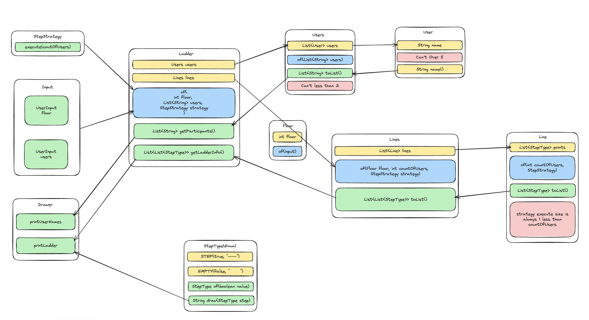

# Description
- 사다리를 구현한다.
- 사다리 게임에 참여하는 사람에 이름을 최대5글자까지 부여할 수 있다. 
- 사다리를 출력할 때 사람 이름도 같이 출력한다. 
- 사람 이름은 쉼표(,)를 기준으로 구분한다. 
- 사람 이름을 5자 기준으로 출력하기 때문에 사다리 폭도 넓어져야 한다. 
- 사다리 타기가 정상적으로 동작하려면 라인이 겹치지 않도록 해야 한다. 
- `|-----|-----|` 모양과 같이 가로 라인이 겹치는 경우 어느 방향으로 이동할지 결정할 수 없다.

# 구현 기능 목록
## 의도
- `Lines`, `Users`는 `Ladder`에 캡슐화 되어 외부에 드러나지 않는다. 

### Role

### Domain Flow

## User
- 참여자의 정보에 대한 역할을 담당하는 클래스
- [x] 사용자의 이름을 담고있다.
    - [x] 이름은 5글자 이하만 가능하다. 5글자 초과 시 `IllegalArgumentException`을 던진다.
    - [x] (역할 : `User` -> `Users`) 사용자의 이름을 줄 수 있다.(`name()`)

## Users
- 참여자 리스트를 가지고 있는 일급 컬렉션
- [x] 사용자의 컬렉션을 담고 있다.
- [x] (역할 : `Users` -> `Drawer`) `Drawer`에서 참여자의 출력을 위해 `List<String>`을 반환 해준다.
- [x] User의 수가 2보다 작다면, `IllegalArgumentException`을 던진다.

## StepType
- Line에서 사용되는, 현재 `step`이 존재하는지 역할을 가지고 있는 Enum
- EMPTY(0, draw), STEP(1, draw)
- [x] `boolean` 파라미터로 어떤 타입인지 반환한다.
- [x] `StepType`으로 draw를 반환한다.

## StepStrategy
- 사다리 발판 선정 역할을 담당하는 전략

## Line
- 사다리의 가로선 역할을 담당하는 클래스. 내부에서 발판의 존재 여부를 `StepType`으로 가지고 있다.
- [ ] 초기 생성 시 전략을 통해 받는다.
- [ ] 위에서 받은 전략 중 이전 사다리의 다리(`StepType.STEP`)이 존재하면, 다음은 `StepType.EMPTY`이여야 한다.
- [ ] 전략을 통해 받은 리스트의 크기는 항상 사용자수보다 1 적다. 그렇지 않으면 `IllegalArguemntException`을 던진다.
- [ ] 참여자의 수의 -1 만큼 위치(`point`)가 존재한다.
- [ ] (역할 : `Line` -> `Lines`) `Drawer`에서 참여자의 출력을 위해 `List<StepType>`을 반환 해 준다.

## Lines
- 가로선 `Line`을 층수(`Height`)만큼 가지고 있는 일급 컬렉션
- [ ] 층고(`Floor`)를 받고, 층고만큼의 `Line`을 가진다.
- [ ] (역할 : `Lines` -> `Ladder`) `Drawer`에서 참여자의 출력을 위해 `List<List<StepType>>`을 반환 해 준다.

## Floor
- 사다리의 층고 역할을 담당하는 클래스
- [ ] 층고를 줄 수 있다.
- [ ] 층고를 반환한다.

## Input
- 사용자의 입력을 받아들이는 역할을 담당하는 클래스
- [ ] 참여자 리스트를 입력 받아 List<String> 형태로 반환한다.
- [ ] 층고를 입력 받아 int 형태로 반환한다.

## Drawer
- 사다리를 그리는 역할을 담당하는 클래스
- [ ] `Lines`를 통해 사다리 그림을 그려준다.

## Ladder
- (역할 : `Ladder` -> `Drawer`) `Drawer`에서 출력을 위해 참여자 목록(`List<String>`)을 반환한다.
- (역할 : `Ladder` -> `Drawer`) `Drawer`에서 출력을 위해 사다리 현황(`List<List<StepType>`)을 반환한다.
